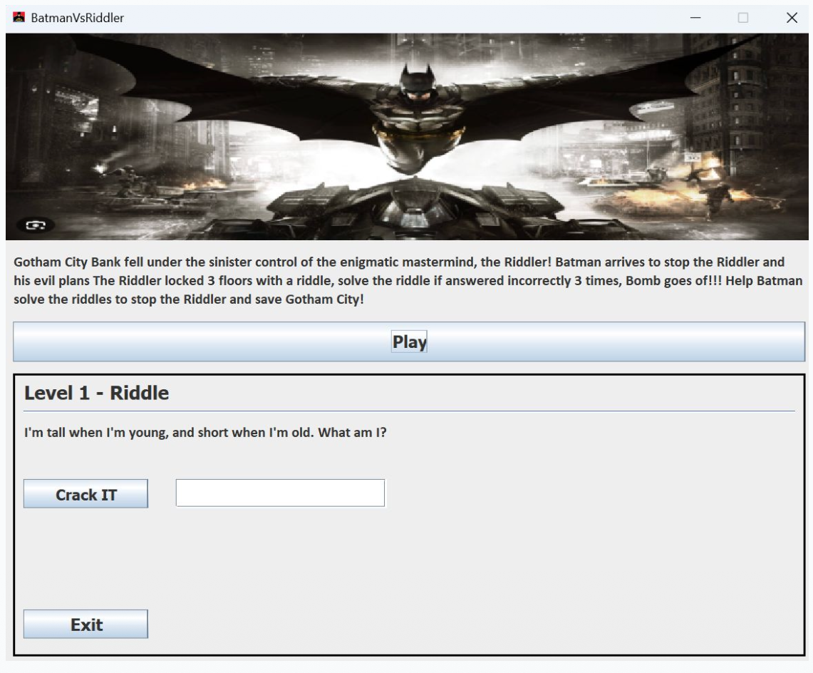

# FSM Batman Riddler Game 
## 1. Project Overview 
This project is a Java based riddle game in which finite state automata is displayed where each riddle corresponds to a state based on the players input. This project demonstrates the transformation of automata theory into Java gameplay using object oriented principles. 

## 2. Project Highlights 
- Implemented a deterministic finite state automata (DFA) in Java where each riddle corresponds to a state
- Built a modular system using object oriented programming (OOP)
- Designed state transitions moving forward or backward based on user feedback 

## 3. Demo 

## 4. How to Use
- Open the project into IntelliJ and run pnlMain.java
- Answer the questions when prompted. Correct answers move the player forward, incorrect sets the player back

## 5. Technologies Utilized
- **Java**
- **JavaFX**
- **Object Oriented** Design
- **Finite Automata Theory**
- **Command-Line Interface** (CLI)

## 6. Key Learnings
- How to translate and handle finite state progression based on user input (interactive gameplay)
- Designing modular systems using object-oriented programming (OOP)
- Collaborating on a team project and integrating JavaFX components 

## 7. Ideas for Future Improvemnent 
- Add a scoring system as well as a leaderboard
- Save the system for longer game play sessions
- Support multiple user profiles
